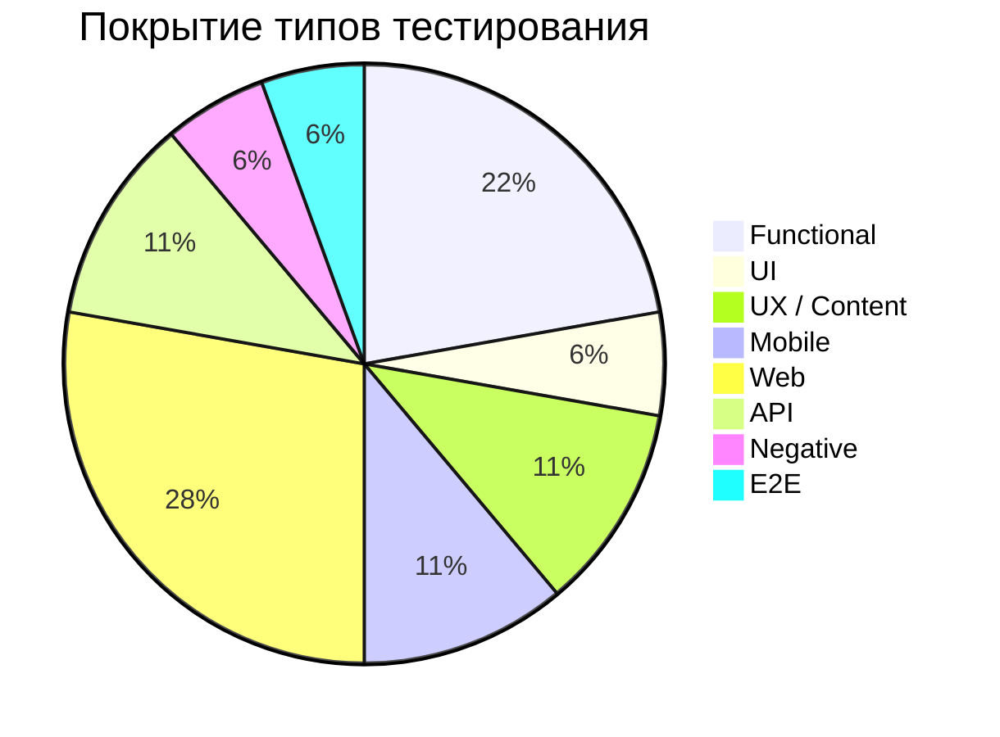

# QA Portfolio

> Портфолио начинающего тестировщика. Здесь собраны баг-репорты,
> чек-листы и примеры ручного тестирования веб- и мобильных приложений.
---

## Обо мне

Специалист службы поддержки пользователей с опытом работы
в сервисах экосистемы Яндекса и практическим опытом
поиска и описания багов в продуктах.

За 4+ года работы в Яндекс Лавке, Яндекс Плюсе,
Яндекс Доставке, Яндекс Драйве и Яндекс Еде
выявляла дефекты и оформляла баг-репорты
с шагами воспроизведения, ожидаемым
и фактическим результатом.

Имею опыт контроля качества по чек-листам,
работы с админ-панелями и взаимодействия
с техническими и продуктовыми командами.

Знакома с теорией тестирования:
функциональное, регрессионное и smoke-тестирование,
жизненный цикл дефекта.

---

## Навыки и инструменты

**Тестирование:**

**Документация:**

**Инструменты:**

**Платформы:**

**Браузеры:**

---

## Оборудование для тестирования

| Устройство | ОС | Назначение |
|------------|----|------------|
| POCO F5 Pro | Android 15 | Тестирование мобильных приложений и мобильного веба |
| HUAWEI YAL-L21 | Android 10 | Тестирование совместимости на разных версиях Android |
| ПК | Windows 11 | Тестирование десктопных веб-приложений |

**Браузеры:** Yandex Browser · Google Chrome · Opera
**Интернет:** 300 Мбит/с

---

## Баг-репорты

### ⭐ Подтверждены командами разработки

| ID | Продукт | Суть дефекта | Тип | Результат |
|----|---------|--------------|-----|-----------|
| [BUG-001](bug-reports/BUG-001.md) | Яндекс Лавка | Кнопка «В корзину» не реагирует на нажатие в составе набора | Functional | Дефект подтверждён, присвоен severity **Blocker** |
| [BUG-004](bug-reports/BUG-004.md) | НКЭиВТ | Учебный год отображается как «2025» вместо «2025/2026» | UX / Display | Дефект подтверждён, исправление запланировано. Отмечен командой разработки как **образец оформления** |

### Остальные баг-репорты

| ID | Продукт | Суть дефекта | Test Type | Severity | Среда |
|----|---------|--------------|-----------|----------|-------|
| [BUG-002](bug-reports/BUG-002.md) | sovcomjob.ru | Layout overlap: форма перекрывает nav-меню в mobile view | UI / Layout | Major | Android 10 |
| [BUG-003](bug-reports/BUG-003.md) | Яндекс Крауд | Mismatch: формулировка вопроса не соответствует типу ответа | Content / UX | Minor | Web |
| [BUG-005](bug-reports/BUG-005.md) | Яндекс Почта | Data inconsistency: счётчик треда показывает «3» при фактических 2 сообщениях | Functional | Major | Web |
| [BUG-006](bug-reports/BUG-006.md) | Электронный город | API response mismatch: сервер возвращает `text/html` вместо `application/json` | Functional / Server-side | Critical | Web |
| [BUG-007](bug-reports/BUG-007.md) | Т-Образование | HTTP 400 Bad Request при вызове endpoint восстановления пароля — server-side error `bff:invalid-email` | Functional / Server-side | Critical | Web |

---

## Покрытие типов тестирования

| Test Type | Technique | Level | Баг-репорты |
|-----------|-----------|-------|-------------|
| Functional Testing | Black-box | UI + API | BUG-001, BUG-005, BUG-006, BUG-007 |
| UI Testing | Layout / Visual | Frontend | BUG-002 |
| UX / Content Testing | Exploratory | UI | BUG-003, BUG-004 |
| Mobile Testing | Cross-platform | Device | BUG-001, BUG-002 |
| Web Testing | Regression | Browser | BUG-003, BUG-004, BUG-005, BUG-006, BUG-007 |
| API Testing | Negative | Server-side | BUG-006, BUG-007 |
| Negative Testing | Boundary / Error flow | UI + API | BUG-007 |
| End-to-End Testing | Scenario-based | UI + API | BUG-007 |

---

## Чек-листы

| Название | Тип |
|----------|-----|
| [Smoke Checklist — мобильное приложение](checklists/smoke-checklist-mobile-app.md) | Smoke |
| [Regression Checklist — корзина интернет-магазина](checklists/regression-checklist-cart.md) | Regression |

---

## Контакты

