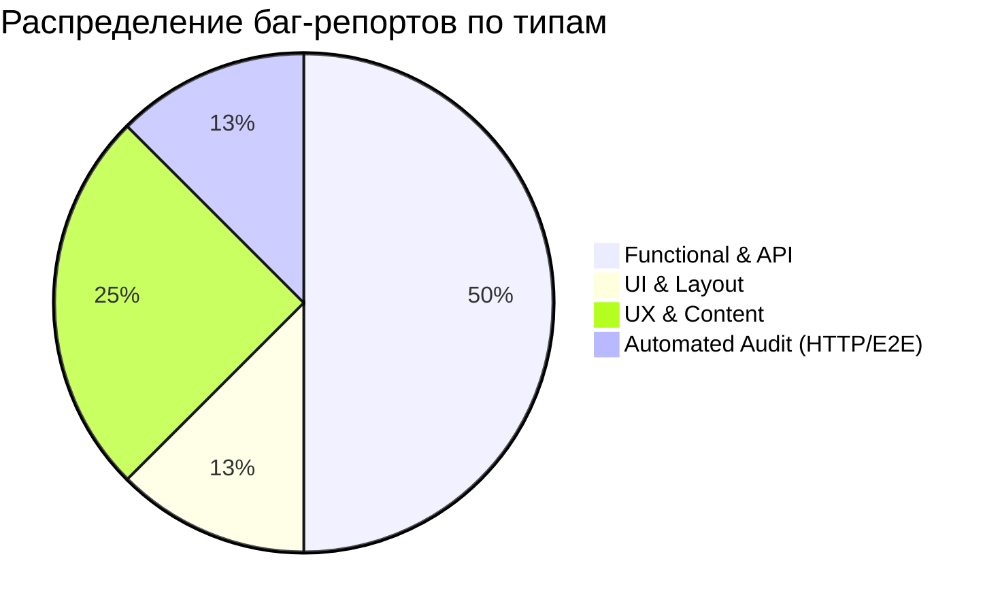

# QA Portfolio

> Портфолио начинающего инженера по тестированию (QA Engineer / QA Intern).
> В репозитории собраны примеры баг-репортов, чек-листов, API/UI проверок, а также кейсы автоматизации и аудита с использованием ИИ.

---

## О себе

Нахожусь в процессе прохождения курса профессиональной переподготовки **«Инженер по тестированию ПО» (507 часов теории и прикладной практики)**.

Обладаю 4+ годами опыта работы в продуктовых экосистемах (**Яндекс**, **GetCourse**, **Т-Банк**). Разбираюсь в процессах поиска и локализации дефектов на уровне веб-интерфейсов, мобильных приложений (Android) и сетевых запросов.

В работе сочетаю классический тест-дизайн с современными инструментами: использую **Chrome DevTools**, проверяю **REST API / HTTP-заголовки**, работаю с **SQL** и применяю **генеративный ИИ** для написания скриптов автоматизации (PowerShell, Python + Playwright).

> 🤖 **Подход к работе (AI-Assisted QA).** Активно использую генеративный ИИ как ассистента для ускорения рутины — генерации скриптов проверки (PowerShell, Python + Playwright), подготовки тестовых данных и краевых сценариев. При этом логику тестирования, анализ результатов и валидацию кода выполняю самостоятельно: ИИ пишет синтаксис, а QA-мышление и постановку задачи обеспечиваю я.

---

## Навыки и инструменты

**Тестирование и Методологии:**

  -3DDC84?style=for-the-badge&logo=android&logoColor=white)    

**Автоматизация и ИИ (AI-Assisted QA):**

   

**Сети, Инструменты и СУБД:**

    

**Платформы и ОС:**

 

---

## Оборудование для тестирования

| Устройство | ОС | Назначение |
|------------|----|------------|
| **POCO F5 Pro** | Android 15 | Тестирование мобильных приложений и мобильного веба |
| **HUAWEI YAL-L21** | Android 10 | Тестирование совместимости на ранних версиях Android |
| **ПК** | Windows 11 | Тестирование десктопного веба, запуск скриптов, DevTools |

---

## Баг-репорты

### ⭐ Ключевые кейсы и дефекты, подтвержденные разработкой

| ID | Продукт | Суть дефекта | Тип / Стек | Результат / Статус |
|----|---------|--------------|------------|--------------------|
| [BUG-001](bug-reports/BUG-001-yandex-lavka-cart-button.md) | **Яндекс Лавка** | Кнопка «В корзину» не реагирует на нажатие в составе набора «Завтрак и кофе» | Mobile / Functional | Подтверждён командой разработки, присвоен severity **Blocker** |
| [BUG-004](bug-reports/BUG-004-journal-wrong-year.md) | **НКЭиВТ** | Учебный год отображается как «2025» вместо «2025/2026» | Web / UX | Подтверждён. Отмечен командой разработки как **эталонный образец оформления** |
| [BUG-008](bug-reports/BUG-008-getcourse-blog-sidebar-broken-links.md) | **GetCourse** | Битые редиректы (HTTP 301) скрытых статей в сайдбаре блога на общий листинг | Web / API / AI Scripting | Автоматизированный аудит 666 ссылок через **PowerShell + Playwright** (AI-Assisted) |

### Дополнительные баг-репорты

| ID | Продукт | Суть дефекта | Test Type | Severity | Окружение |
|----|---------|--------------|-----------|----------|-----------|
| [BUG-002](bug-reports/BUG-002-sovcomjob-menu-overlay.md) | sovcomjob.ru | Layout overlap: форма перекрывает навигационное меню | UI / Layout | Major | Android 10 |
| [BUG-003](bug-reports/BUG-003-yandex-crowd-test-wording.md) | Яндекс Крауд | Mismatch: текст вопроса («верные») не соответствует radio button | Content / UX | Minor | Web |
| [BUG-005](bug-reports/BUG-005-yandex-mail-thread-counter.md) | Яндекс Почта | Data inconsistency: счётчик треда показывает «3» при фактических 2 сообщениях | Functional / Cache | Major | Web |
| [BUG-006](bug-reports/BUG-006-electrogorod-recovery-json-error.md) | Электронный город | API error: сервер возвращает HTML `<!DOCTYPE...` вместо JSON | Functional / Server-side | Critical | Web / DevTools |
| [BUG-007](bug-reports/BUG-007-Bad-Request.md) | Т-Образование | HTTP 400 Bad Request при восстановлении пароля (`bff:invalid-email`) | Functional / API | Critical | Web / DevTools |

---

## Покрытие типов тестирования


```mermaid
pie title Распределение баг-репортов по типам
    "Functional & API" : 4
    "UI & Layout" : 1
    "UX & Content" : 2
    "Automated Audit (HTTP/E2E)" : 1
```

| Test Type | Technique | Level | Баг-репорты |
|-----------|-----------|-------|-------------|
| **Functional Testing** | Black-box, Error Flow | UI + API | BUG-001, BUG-005, BUG-006, BUG-007 |
| **UI / Layout Testing** | Visual Inspection | Frontend | BUG-002 |
| **UX / Content Testing** | Exploratory Testing | UI | BUG-003, BUG-004 |
| **Mobile Testing** | Device Testing | Android 10 / 15 | BUG-001, BUG-002 |
| **Web & API Testing** | DevTools Network Analysis | Server-side / Client | BUG-006, BUG-007, BUG-008 |
| **AI-Assisted Automation** | Scripted HTTP & E2E Audit | PowerShell / Playwright | BUG-008 |

---

## Автоматизированные тесты

В `tests/` — двухуровневая автоматизация бага [BUG-008](bug-reports/BUG-008-getcourse-blog-sidebar-broken-links.md) (битые ссылки в правом сайдбаре публичного блога GetCourse).

| Слой | Файл | Инструмент | Что проверяет |
|------|------|------------|---------------|
| Layer 1 — HTTP/Route-check | [test_bug008_route_check.py](tests/test_bug008_route_check.py) | pytest + requests | Редиректы 301 на /pl/blog без браузера: 5 ссылок × 3 проверки + доступность страницы (17 тестов) |
| Layer 2 — UI E2E | [test_bug008_e2e.py](tests/test_bug008_e2e.py) | pytest + Playwright | Путь гостя без авторизации: ссылка в сайдбаре, клик, новая вкладка, редирект (20 тестов) |

**Запуск:**

```powershell
py -m pip install -r requirements.txt
py -m playwright install chromium
py -m pytest tests/ -v
```

HTTP-слой против живого сайта (прогон 12.09.2026): **17 passed**.
E2E-слой требует установленного Chromium.

---

## Bug Reporter (pet-project)

Мини-трекер багов на **Flask + SQLite** с Jira-подобным интерфейсом — собственный инструмент для ведения портфолио-багов (`tools/bug-reporter/`, подробнее — [tools/bug-reporter/README.md](tools/bug-reporter/README.md)).

**Возможности:**

- Список багов со статистикой: total / open / in progress / resolved / critical
- Карточка бага: severity, priority, статус, URL, вложения, скриншоты
- Комментарии, навигация prev/next, смена статуса в один клик
- Импорт багов из `bug-reports/*.md` (`import_bugs.py`)
- Telegram-уведомления о багах (`telegram_notifier.py`): карточка с severity, ссылкой на репорт и штампом времени; конфиг — только переменные окружения, без секретов в коде; 24 теста на моках в `tests/test_telegram_notifier.py`

**Запуск:**

```powershell
cd tools/bug-reporter
py -m pip install -r requirements.txt
py import_bugs.py
py app.py
# → http://127.0.0.1:5000
```

---

## Чек-листы и Тестовая документация

| Название | Тип | Описание |
|----------|-----|----------|
| [Smoke Checklist — мобильное приложение](checklists/smoke-checklist-mobile-app.md) | Smoke | Чек-лист проверки критического пути мобильного приложения |
| [Regression Checklist — корзина интернет-магазина](checklists/regression-checklist-cart.md) | Regression | Проверка логики добавления товаров, наборов и расчета скидок |

---

## Контакты

[](mailto:ms1gnatov1@yandex.ru)

