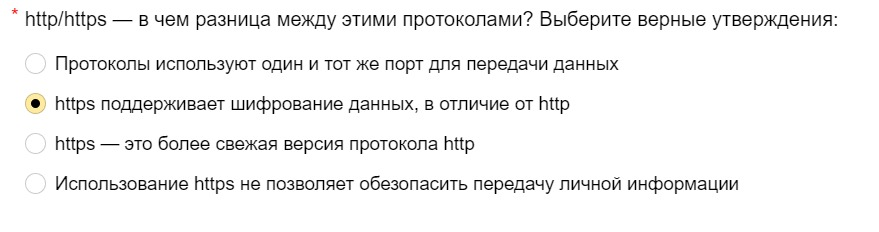

# BUG-003: Формулировка вопроса в тесте не соответствует типу выбора ответа

## Общая информация

- **Проект:** Яндекс Крауд — страница отбора кандидатов
- **URL:** https://yandex.ru/project/remote-work/remote_work_vacancies/support/kons_plus_chat
- **Тип бага:** Контент / UX
- **Серьёзность:** Minor
- **Приоритет:** Medium
- **Статус:** New
- **Воспроизводимость:** Always
- **Дата обнаружения:** 05.07.2023

---

## Окружение

- **Платформа:** Десктоп и мобайл (воспроизводится на обоих)
- **Браузер:** Yandex Browser

---

## Предусловия

- Пользователь открыл страницу теста отбора
  на вакансию «Консультант Плюс (чат)»
- Вопросы теста отображаются корректно

---

## Шаги воспроизведения

1. Открыть страницу теста:
   https://yandex.ru/project/remote-work/remote_work_vacancies/support/kons_plus_chat
2. Найти вопрос: «http/https — в чём разница
   между этими протоколами?»
3. Сравнить формулировку задания
   и тип элемента выбора ответа

---

## Ожидаемый результат

Если доступен только один вариант ответа (radio button),
формулировка должна быть в единственном числе:
«Выберите **верное** утверждение».

Если правильных ответов несколько,
должны использоваться checkbox, а не radio button.

---

## Фактический результат

Формулировка задания: «Выберите **верные** утверждения»
(множественное число — подразумевает несколько ответов).

При этом элемент управления — radio button,
который позволяет выбрать только один вариант.

Противоречие: текст говорит «выберите несколько»,
а интерфейс позволяет выбрать только один.

---

## Влияние на пользователя

- Кандидат видит «верные утверждения» и думает,
  что правильных ответов несколько
- Пытается выбрать несколько вариантов,
  но radio button сбрасывает предыдущий выбор
- Тратит время на сомнения и повторный анализ
- Может дать неверный ответ из-за путаницы

Для теста отбора это критично: некорректная формулировка
может привести к отсеву подходящих кандидатов.

---

## Предлагаемое решение

Изменить текст вопроса с:
> «Выберите верн**ые** утверждени**я**»

На:
> «Выберите верн**ое** утверждени**е**»

Либо заменить radio button на checkbox,
если подразумевается выбор нескольких вариантов.

---

## Вложения

