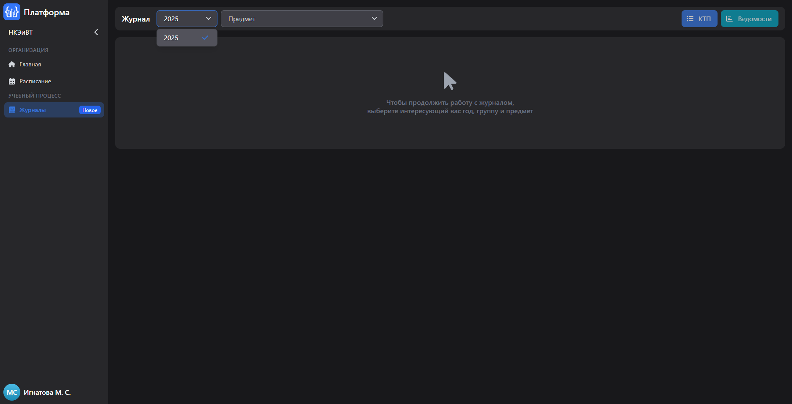

# BUG-004: В разделе «Журналы» учебный год отображается неоднозначно — «2025» вместо «2025/2026»

## Общая информация

- **Проект:** НКЭиВТ (образовательная платформа)
- **Раздел:** Учебный процесс → Журналы
- **Тип бага:** UX / Отображение
- **Серьёзность:** Minor
- **Приоритет:** Low
- **Статус:** New
- **Воспроизводимость:** Always

---

## Окружение

- **Роль пользователя:** Студент
- **ОС:** Windows
- **Браузер:** Яндекс Браузер 25.8.1.889 corp-ext (64-bit)

---

## Предусловия

- Пользователь авторизован в системе под ролью «Студент»
- Текущая дата находится в рамках учебного года
  2025/2026 (сентябрь 2025 — июнь 2026)

---

## Шаги воспроизведения

1. Авторизоваться в системе под ролью студента
2. Перейти в раздел «Учебный процесс → Журналы»
3. Обратить внимание на значение в поле выбора года

---

## Ожидаемый результат

В поле «Год» отображается полное обозначение
учебного года в формате **«2025/2026»**,
что однозначно указывает на текущий учебный период.

## Фактический результат

В поле «Год» отображается только **«2025»**.

В контексте второго семестра (январь — июнь 2026)
это создаёт неоднозначность: пользователь может
интерпретировать «2025» как прошлый календарный год,
а не как текущий учебный год.

---

## Влияние на пользователя

- Студент во втором семестре (2026 год) видит «2025»
  и может решить, что отображаются данные за прошлый год
- Возникает путаница: нужно ли искать «2026»
  в списке или «2025» — это и есть текущий период
- Особенно критично для новых пользователей,
  которые не знакомы с логикой системы

---

## Предлагаемое решение

Изменить формат отображения учебного года с:
> **2025**

На:
> **2025/2026**

Это стандартный формат обозначения учебного года
в образовательных системах и исключает неоднозначность.

---

## Вложения

