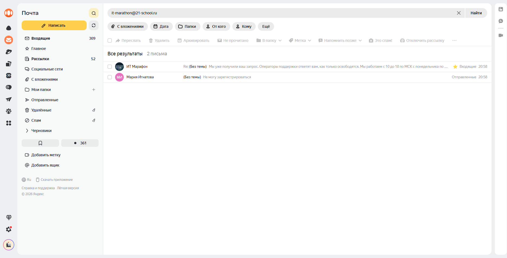

# BUG-005: Счётчик писем в цепочке отображает «3» вместо фактических 2 сообщений

## Общая информация

- **Проект:** Яндекс Почта (веб-версия)
- **Тип бага:** Функциональный (рассинхронизация данных)
- **Серьёзность:** Major
- **Приоритет:** Medium
- **Статус:** New
- **Воспроизводимость:** Always
- **Дата обнаружения:** 30.01.2026

---

## Окружение

- **ОС:** Windows
- **Браузер:** Яндекс Браузер 25.8.1.889 corp-ext (64-bit)
- **Версия продукта:** Яндекс Почта (Web), 2026

---

## Предусловия

- Пользователь авторизован в Яндекс Почте
- В почтовом ящике есть цепочка переписки,
  состоящая из 2 писем:
  исходящее письмо и входящий ответ

---

## Шаги воспроизведения

1. Написать и отправить письмо на адрес получателя
2. Получить ответ от получателя
3. Перейти в папку «Входящие» или воспользоваться поиском
4. Посмотреть на бейдж количества сообщений
   в цепочке переписки

---

## Ожидаемый результат

Счётчик цепочки отображает **«2»**,
что соответствует фактическому количеству писем:
1. Исходящее письмо
2. Входящий ответ

## Фактический результат

Счётчик цепочки отображает **«3»**.

При раскрытии цепочки видно только 2 письма.
Третьего письма не существует:
- нет в черновиках
- нет в спаме
- нет в удалённых
- нет в других папках

---

## Дополнительные наблюдения

- Поиск по адресу находит **2 письма**
  (считая строки результатов),
  но внутри первой строки (цепочки) стоит **«3»**
- Это подтверждает рассинхронизацию между
  фактическим количеством писем
  и данными счётчика цепочки

---

## Влияние на пользователя

- Пользователь видит «3 письма» и ищет третье,
  которого не существует
- Создаётся впечатление, что письмо потерялось
  или было скрыто
- Подрывает доверие к корректности работы почтового сервиса

---

## Предположение о причине

Вероятно, счётчик цепочки учитывает
служебные или технические сообщения
(например, уведомление о доставке, системный заголовок),
которые не отображаются пользователю,
но увеличивают значение счётчика.

Либо при формировании цепочки происходит
некорректный подсчёт: одно из писем
считается дважды.

---

## Вложения

