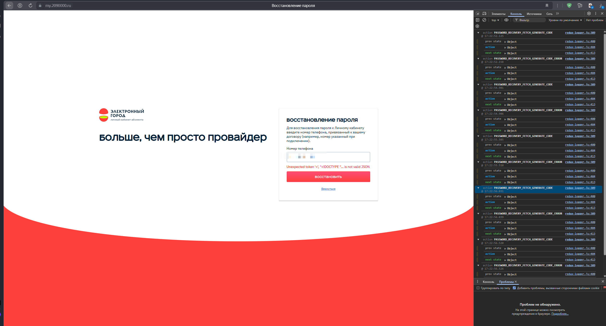

# BUG-006: Форма восстановления пароля отображает техническую ошибку «Unexpected token '<', "<!DOCTYPE "... is not valid JSON»

## Общая информация

- **Проект:** Электронный город (личный кабинет абонента)
- **URL:** https://my.2090000.ru/recovery/
- **Тип бага:** Функциональный / Серверный
- **Серьёзность:** Critical
- **Приоритет:** High
- **Статус:** New
- **Воспроизводимость:** Always
- **Дата обнаружения:** 28.03.2026

---

## Окружение

- **ОС:** Windows 11 Pro, версия 25H2, сборка 26200.8039
- **Браузер:** Яндекс Браузер 25.8.1.889 corp-ext (64-bit)
- **URL страницы:** https://my.2090000.ru/recovery/

---

## Предусловия

- Пользователь не авторизован
- Пользователь открыл страницу восстановления пароля

---

## Шаги воспроизведения

1. Перейти на страницу восстановления пароля:
   https://my.2090000.ru/recovery/
2. Ввести номер телефона в поле «Номер телефона»
3. Нажать кнопку «Восстановить»

---

## Ожидаемый результат

Система принимает номер телефона,
отправляет код восстановления
и переводит пользователя на следующий шаг
или отображает сообщение об успешной отправке кода.

---

## Фактический результат

Под полем ввода номера телефона отображается
техническое сообщение об ошибке:

`Unexpected token '<', "<!DOCTYPE "... is not valid JSON`

Код восстановления не отправляется.
Пользователь не может восстановить пароль.

---

## Дополнительные наблюдения

1. Ошибка отображается прямо в пользовательском интерфейсе,
   без понятного сообщения для пользователя.

2. В DevTools зафиксированы повторяющиеся действия:

   - `PASSWORD_RECOVERY_FETCH_GENERATE_CODE`
   - `PASSWORD_RECOVERY_FETCH_GENERATE_CODE_ERROR`

3. Последовательность `FETCH → ERROR` повторяется многократно,
   что указывает на неуспешные повторные попытки запроса.

---

## Влияние на пользователя

- Пользователь не может восстановить пароль
  и получить доступ к личному кабинету
- Вместо понятного сообщения отображается
  технический текст ошибки
- Функция восстановления пароля фактически недоступна

---

## Предположение о причине

Фронтенд ожидает ответ от сервера в формате JSON,
но получает HTML-документ
(предположительно страницу ошибки,
начинающуюся с `<!DOCTYPE ...>`).

Из-за этого возникает ошибка парсинга JSON:

`Unexpected token '<'`

Возможные причины:
- сервер возвращает HTML-страницу ошибки вместо JSON
- некорректно настроен API-эндпоинт восстановления пароля
- ошибка маршрутизации на стороне бэкенда
- некорректная обработка ответа на фронтенде

---

## Вложения

**Скриншот — ошибка в интерфейсе и логи DevTools:**

