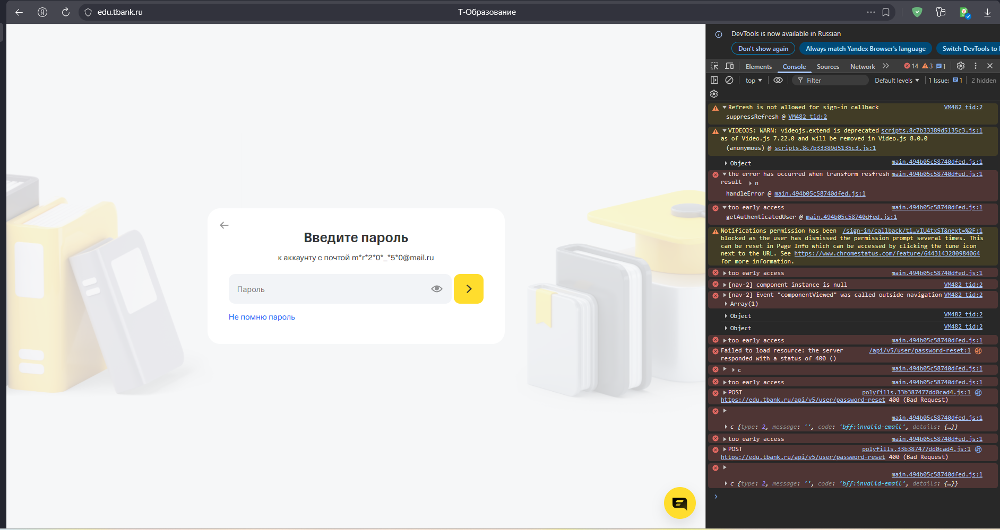

# BUG-007: Ошибка 400 (Bad Request) при попытке восстановления пароля на платформе Т-Образования — сервер возвращает `bff:invalid-email`

## Общая информация

- **Проект:** Т-Образование (edu.tbank.ru)
- **Раздел:** Авторизация → Восстановление пароля
- **URL:** https://edu.tbank.ru/sign-in/
- **Тип бага:** Функциональный / Серверный
- **Серьёзность:** Critical
- **Приоритет:** High
- **Статус:** New
- **Воспроизводимость:** Always
- **Дата обнаружения:** 15.04.2026

## Окружение

- **ОС:** Microsoft Windows 11 Pro, версия 10.0.22631, Сборка 22631
- **Браузер:** Яндекс Браузер 26.3.1.1080 corp-ext (64-bit)
- **URL страницы:** https://edu.tbank.ru/sign-in/

## Предусловия

- Пользователь не авторизован
- Пользователь открыл страницу авторизации и ввёл email
- Пользователь перешёл к экрану ввода пароля

## Шаги воспроизведения

1. Перейти на страницу авторизации: https://edu.tbank.ru/sign-in/
2. Ввести email в поле авторизации
3. Нажать кнопку «Продолжить» для перехода к экрану ввода пароля
4. На экране ввода пароля нажать на ссылку **«Не помню пароль»**

## Ожидаемый результат

Система принимает email, отправляет код восстановления и переводит пользователя на следующий шаг или отображает сообщение об успешной отправке кода.

Запрос `POST /api/v5/user/password-reset` возвращает статус **200 (OK)**.

## Фактический результат

Восстановление пароля не происходит. Запрос возвращает статус **400 (Bad Request)** с кодом ошибки `bff:invalid-email`. Код восстановления не отправляется. Пользователь не может восстановить пароль.

## Дополнительные наблюдения

В DevTools (Console) зафиксированы следующие ошибки:

**До нажатия «Не помню пароль»:**
```
Refresh is not allowed for sign-in callback
the error has occurred when transform refresh result
too early access (×5)
[nav-2] component instance is null
[nav-2] Event "componentViewed" was called outside navigation
```

**При попытке восстановления пароля:**
```
POST https://edu.tbank.ru/api/v5/user/password-reset 400 (Bad Request)
c {type: 2, message: '', code: 'bff:invalid-email', details: {…}}
```

Последовательность FETCH → ERROR повторяется дважды, что указывает на автоматическую повторную попытку запроса, которая также завершается неудачей.

## Влияние на пользователя

- Пользователь не может восстановить пароль и получить доступ к платформе
- Функция восстановления пароля фактически недоступна
- В контексте подачи документов на стажировку пользователь теряет возможность подать заявку в срок

## Предположение о причине

Множественные ошибки `"too early access"` указывают на обращение к данным пользователя до завершения инициализации сессии, из-за чего email может не передаваться в запрос восстановления.

**Возможные причины:**
- Email не передаётся из формы авторизации в запрос — на сервер уходит пустое или невалидное значение
- Компонент восстановления пароля запрашивает данные пользователя до их готовности
- Некорректная обработка email на стороне BFF
- Ошибка конфигурации эндпоинта `/api/v5/user/password-reset`


## Дополнительные наблюдения

**Новый лог консоли от 22.04.2026 подтверждает стабильность бага:**

main.21cc80e2bfdc3a16.js:1 too early access
/api/v5/user/password-reset:1 Failed to load resource: the server responded with a status of 400 ()
main.21cc80e2bfdc3a16.js:1 c {type: 2, message: '', code: 'bff:invalid-email', details: {…}}
polyfills.33b387477dd0cad4.js:1 POST https://edu.tbank.ru/api/v5/user/password-reset 400 (Bad Request)
main.21cc80e2bfdc3a16.js:1 c {type: 2, message: '', code: 'bff:invalid-email', details: {…}}
Ключевые наблюдения:

Ошибка bff:invalid-email возвращается стабильно при каждом запросе
Запрос на восстановление пароля отправляется минимум 2 раза (автоматический retry + повторные нажатия)
Многочисленные ошибки net::ERR_BLOCKED_BY_CLIENT на api-statist.tinkoff.ru/gateway/v1/events (аналитика)
Повторяющиеся ошибки too early access
Данные ошибки указывают на проблему инициализации состояния пользователя перед отправкой запроса на восстановление пароля.

## Вложения


